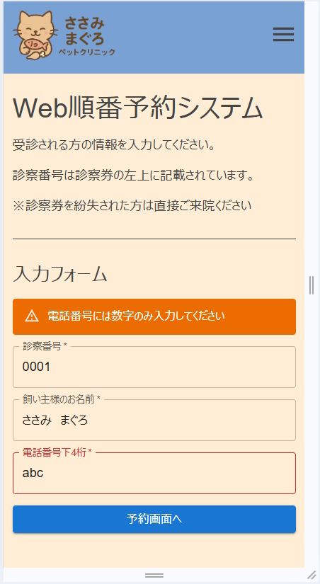
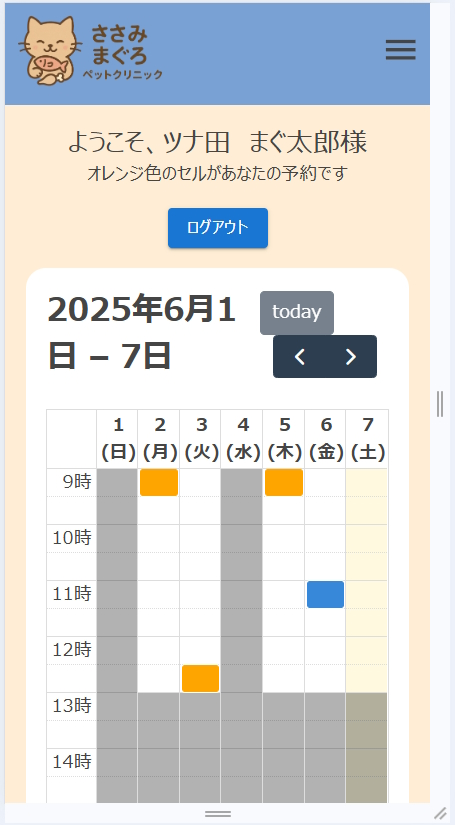
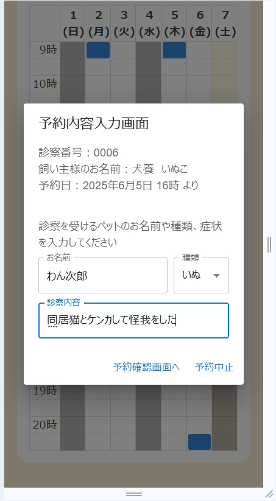

# Web順番予約アプリ
Fullcalendar.jsとFirestoreの連携による予約管理機能を持たせたアプリです。  
ログイン画面では簡易的な入力チェック（未入力、数字を入れるべき場所に数字以外の文字が入っているか）を行います。  
なおユーザマスタは設定していません。    
予約管理画面では利用者個人での予約登録が出来ます。  
自身の置かれている状況が変わったため、いったん予約登録機能実装までで作業完了としています。  
時間があれば予約変更や取消機能も実装したい。  
Vercelにて公開しています　→　([リンク](https://reserve-system-2.vercel.app/))  

※実際に予約登録が出来ますが、設計の都合上、即時反映されません。   
　再度ログインしなおすことでレンダリングが走り、登録した予約が見れるようになります。  

## スクリーンショット

  
  
  

## 技術スタック
- HTML/CSS
- TypeScript
- Fullcalendar.js
- React
- Vite
- MaterialUI
- Firebase/Firestore

## 作成の狙い
- Firestoreを活用したNoSQLの技術習得
- TypeScriptによるコーディングの練習
- Fullcalendar.jsの知識習得

## 反省点
- 予約登録機能について  
登録後、ユーザに見せるカレンダーへの即時反映が出来ないことが判明。  
firestoreのonSnapshotを使うか、Routeによる画面遷移が必要であった。  
発覚のタイミングがそれなりに作成段階が進んでいたため、実装を断念。  
また即時反映については予約変更や取消についても同じことが言える。  
今回のようなケースは画面遷移を採用するべきだった。  
- 実装しきれていないもの  
自身の置かれた状況の変化により、以下のものは当初予定していたが未実装
  - Firebaseを用いたGoogleOATHによる認証
  - 患者の予約を確認したり、病院の休診日を追加できる管理者用画面
  - 患者予約画面での予約変更・取消機能

## アイコンについて
本サイトでは [MUI](https://mui.com/) のコンポーネントを使用しています。